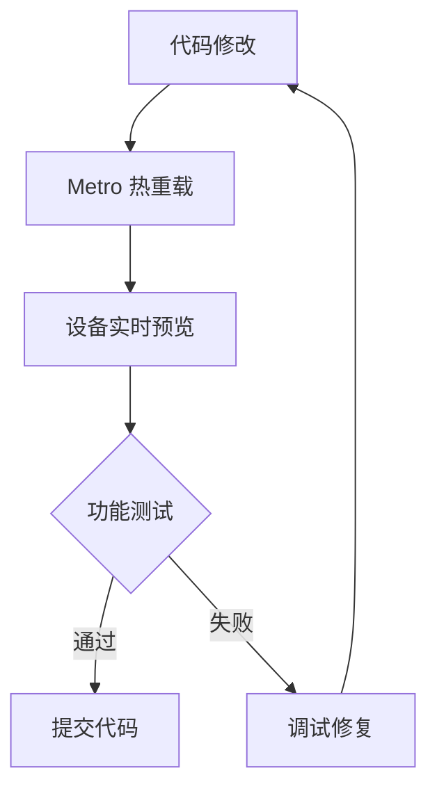
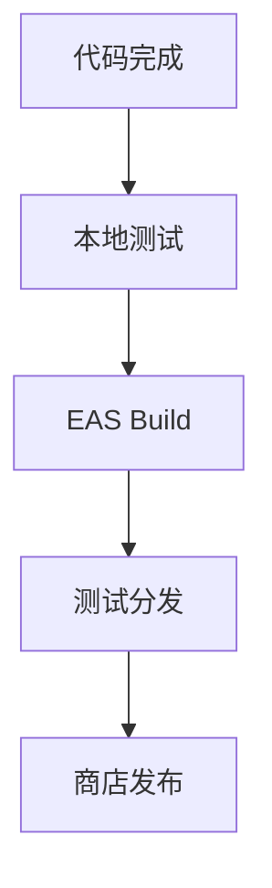

# MyMacro AI 技术架构与开发环境配置

## 技术栈架构设计

### 整体架构层次
```
┌─────────────────────────────────────────────┐
│               应用层 (Application)           │
│  - 用户界面组件                              │
│  - 业务逻辑                                  │
│  - 路由导航                                  │
├─────────────────────────────────────────────┤
│               服务层 (Services)              │
│  - 健康数据服务                              │
│  - AI 分析服务                               │
│  - 存储服务                                  │
├─────────────────────────────────────────────┤
│              状态管理层 (State)              │
│  - Zustand 全局状态                         │
│  - MMKV 持久化存储                           │
│  - React Query 服务端状态                   │
├─────────────────────────────────────────────┤
│              原生功能层 (Native)             │
│  - Expo 官方模块                            │
│  - 健康 API 集成                            │
│  - 设备传感器                               │
└─────────────────────────────────────────────┘
```

## 开发环境技术要求

### 1. 系统环境要求
| 组件 | 最低版本 | 推荐版本 | 验证命令 |
|------|----------|----------|----------|
| Node.js | 16.x | 18.x+ | `node --version` |
| npm | 6.x | 8.x+ | `npm --version` |
| Expo CLI | 6.x | 最新版 | `npx expo --version` |
| Git | 2.19+ | 最新版 | `git --version` |

### 2. 移动平台要求
| 平台 | 最低版本 | 目标版本 | 测试设备要求 |
|------|----------|----------|--------------|
| iOS | 15.1 | 16.0+ | iPhone 12+ |
| Android | 6.0 (API 23) | 12.0+ | 主流 Android 设备 |

## 配置文件架构

### 1. 项目根配置文件
```
MyMacroAI/
├── app.json                 # Expo 应用配置
├── app.config.js           # Expo 动态配置
├── package.json            # 依赖管理
├── tsconfig.json          # TypeScript 配置
├── tailwind.config.js     # TailwindCSS 配置
├── babel.config.js        # Babel 转译配置
├── metro.config.js        # Metro 打包配置
└── .gitignore            # Git 忽略规则
```

### 2. 核心配置文件详解

#### app.json (Expo 静态配置)
```json
{
  "expo": {
    "name": "MyMacroAI",
    "slug": "mymacroai",
    "version": "1.0.0",
    "orientation": "portrait",
    "icon": "./assets/icon.png",
    "userInterfaceStyle": "automatic",
    "splash": {
      "image": "./assets/splash.png",
      "resizeMode": "contain",
      "backgroundColor": "#ffffff"
    },
    "assetBundlePatterns": ["**/*"],
    "ios": {
      "supportsTablet": true,
      "bundleIdentifier": "com.mymacroai.app"
    },
    "android": {
      "adaptiveIcon": {
        "foregroundImage": "./assets/adaptive-icon.png",
        "backgroundColor": "#FFFFFF"
      },
      "package": "com.mymacroai.app"
    },
    "web": {
      "favicon": "./assets/favicon.png"
    },
    "plugins": [
      "expo-router",
      [
        "expo-camera",
        {
          "cameraPermission": "Allow MyMacroAI to access your camera."
        }
      ]
    ]
  }
}
```

#### tailwind.config.js (NativeWind 配置)
```javascript
/** @type {import('tailwindcss').Config} */
module.exports = {
  content: ["./app/**/*.{js,jsx,ts,tsx}"],
  presets: [require("nativewind/preset")],
  theme: {
    extend: {
      colors: {
        primary: {
          50: '#f0f9ff',
          500: '#3b82f6',
          900: '#1e3a8a',
        },
        spartan: {
          gray: '#374151',
          red: '#dc2626'
        }
      },
      fontFamily: {
        sans: ['Inter', 'system-ui'],
        mono: ['JetBrains Mono', 'monospace'],
      }
    },
  },
  plugins: [],
}
```

## 开发工作流设计

### 1. 本地开发流程


### 2. 构建发布流程


## 性能优化策略

### 1. 打包优化
- **Hermes 引擎**: 启用 Hermes 提升 JavaScript 性能
- **代码分割**: 使用动态导入优化首屏加载
- **图片优化**: 使用 WebP 格式和适量压缩

### 2. 运行时优化
- **状态管理**: 使用 Zustand 的选择器避免不必要重渲染
- **列表优化**: 使用 FlashList 或 FlatList 优化长列表
- **内存管理**: 及时清理事件监听器和定时器

## 测试策略

### 1. 单元测试
- **工具**: Jest + React Native Testing Library
- **范围**: 工具函数、工具类、业务逻辑
- **目标**: 80%+ 代码覆盖率

### 2. 集成测试
- **工具**: Detox 或 Maestro
- **范围**: 用户流程、核心功能
- **目标**: 关键路径 100% 覆盖

### 3. 手动测试清单
- [ ] iOS 设备功能测试
- [ ] Android 设备功能测试
- [ ] 健康数据采集测试
- [ ] AI 分析功能测试
- [ ] 离线功能测试

## 监控与日志

### 1. 错误监控
- **工具**: Sentry 或 Bugsnag
- **配置**: 生产环境错误收集
- **报警**: 关键错误实时通知

### 2. 性能监控
- **指标**: 启动时间、FPS、内存使用
- **工具**: React Native Performance Monitor
- **优化**: 基于数据驱动优化

## 安全考虑

### 1. 数据安全
- **健康数据**: 本地加密存储
- **网络通信**: HTTPS + 证书锁定
- **API 密钥**: 环境变量管理

### 2. 隐私合规
- **权限管理**: 按需请求用户权限
- **数据收集**: 明确告知用户数据用途
- **GDPR/CCPA**: 遵循相关隐私法规

---
**架构设计完成时间**: 2026-01-12  
**技术可行性**: ✅ 高  
**扩展性**: ✅ 良好  
**维护性**: ✅ 优秀