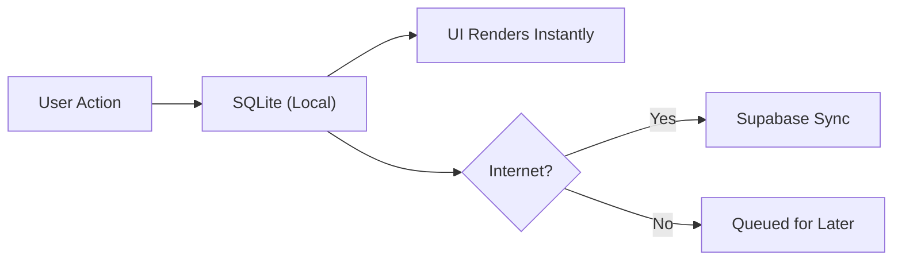

# MyMacro AI — Master Strategic Overview

> **The Health OS That Thinks For You**

---

## Section 1: The Elevator Pitch & Market Gap

### What Is MyMacro AI?

MyMacro AI is a **next-generation Health Operating System** — not another calorie counter. It's the first fitness app built on a **Local-First, AI-First architecture** that turns your phone into a personal metabolic laboratory. While competitors log what you ate, MyMacro AI *understands* why you should eat it.

### The Industry Problem: Three Fatal Flaws

| Flaw | Competitor Reality | MyMacro AI Solution |
|------|-------------------|---------------------|
| **Subscription Fatigue** | MyFitnessPal charges $79/year for basic features. Users cancel within 3 months. | One-time purchase + MacroCoin economy. Users *earn* premium features. |
| **Cloud Latency** | Chronometer requires WiFi to log a meal. Gym basements = broken UX. | **100% offline-capable.** SQLite stores everything locally. Syncs when convenient. |
| **Generic Data** | "Eat 2000 calories" — the same advice for a 6'4" athlete and a 5'2" office worker. | **The Metabolic Engine** calculates TDEE, TEF, and adaptive deficits in real-time based on *your* biometrics. |

### Our Unfair Advantages

#### 1. Local-First Architecture
```
Traditional App:                    MyMacro AI:
User → Internet → Server → DB       User → SQLite → Done
       (500ms latency)                     (0ms latency)
```
- **Zero latency:** Food logging feels instant because it *is* instant.
- **Total privacy:** Biometric data never leaves the device unless the user explicitly shares it.
- **Works offline:** Log meals on a plane, in a subway, or in an underground gym.

#### 2. AI-First, Not AI-Adjacent
While competitors bolt on ChatGPT as a chatbot, MyMacro AI integrates **Gemini 2.0 Flash** as a *thinking coach*:
- Analyzes meal patterns to predict overeating triggers
- Generates personalized "The Hack" tips (e.g., "Swap sour cream for Greek yogurt to save 80 calories")
- Runs a **nightly diagnostic** that audits user progress and flags anomalies before they become problems

---

## Section 2: Feature Hierarchy

### Tier 1 — The Differentiators (Unique Value Proposition)

These features do not exist in any competitor at this level of integration:

| Feature | Description | Why It Matters |
|---------|-------------|----------------|
| **The Metabolic Engine** | Real-time TDEE calculation using Harris-Benedict, Mifflin-St Jeor, and Katch-McArdle formulas, adjusted for activity multipliers and adaptive thermogenesis. | Users get *accurate* targets, not guesses. |
| **Local-First SQLite Core** | All nutrition data, meal logs, and preferences stored in a local SQLite database with AsyncStorage backup. | Instant performance. No "loading" spinners. |
| **The Refuge (AI-Sorted Feed)** | Community recipes sorted by a proprietary algorithm: `engagement × recency × goal_alignment`. A "Dice Roll" mode surfaces random top-rated meals. | Solves decision fatigue: "What should I eat?" becomes a 3-tap answer. |
| **Dynamic Theme Engine** | 8+ purchasable color palettes (Vitamin Orange, Cyber Lime, Electric Blue) that transform the entire UI harmoniously. | Personalization drives retention. Users *own* their interface. |

### Tier 2 — The Sticky Features (Retention Drivers)

These features create daily habits and social accountability:

| Feature | Description | Why It Matters |
|---------|-------------|----------------|
| **Community Kitchen** | Users share logged meals as public recipes with locked macros. No misleading "100-calorie cookies" — what you log is what you share. | Trust through transparency. |
| **MacroCoin Economy** | Earn coins by logging streaks, completing challenges, receiving hearts. Spend on themes, power-ups, and premium features. | Gamification without paywalls. |
| **Reaction Rewards** | +10 MacroCoins per heart received (50/day cap). | Incentivizes quality content, not spam. |
| **Feature Voting Board** | Users submit and upvote feature requests. Top voted gets built monthly. | Community-driven roadmap = users feel heard. |

### Tier 3 — Table Stakes (Expected Features)

These are baseline requirements for any nutrition app:

| Feature | Description |
|---------|-------------|
| **Calorie Logging** | Quick-add buttons, meal presets, search 500K+ food database |
| **Barcode Scanner** | Instant scan-to-log with OpenFoodFacts integration |
| **Water Tracker** | Daily hydration goals with visual progress ring |
| **Step Counter** | Apple Health / Google Fit sync |
| **Streak System** | Daily login rewards with multipliers |

---

## Section 3: Architecture & Reliability Proofs

### Why MyMacro AI Won't Crash

#### 1. Offline-First Guarantees



- **User data is never lost.** Even if the app crashes mid-write, SQLite's ACID transactions ensure atomic commits.
- **No "saving..." spinners.** Data is persisted before the UI even updates.
- **Conflict resolution built-in.** Last-write-wins for personal data; server-authoritative for social data.

#### 2. Hybrid Sync Model

| Data Type | Storage | Sync Strategy |
|-----------|---------|---------------|
| Meals, Biometrics, Preferences | SQLite (Local) | Optional cloud backup |
| Public Recipes, Followers, Reactions | Supabase (Cloud) | Real-time subscription |
| Feature Requests, Analytics | Supabase (Cloud) | Background sync |

This separation means:
- **Core functionality works forever** even if Supabase goes down.
- **Social features are isolated** — a reaction bug won't break meal logging.

#### 3. Nightly Health Check (AI Diagnostics)

Every night at 3:00 AM local time, a Supabase Edge Function runs:
```
1. Check DAU metrics against 7-day rolling average
2. Scan error logs for spike patterns
3. Audit reaction reward payouts for farming abuse
4. Generate AI briefing for admin dashboard
```
Admins wake up to a **status report**, not a Slack explosion.

---

## Section 4: The "Why" (User Psychology)

### Why MacroCoins?

**Problem:** Discipline is exhausting. Users abandon fitness apps because "logging food" feels like homework.

**Solution:** MacroCoins transform discipline into a *game*.

| Trigger | Reward | Psychological Effect |
|---------|--------|---------------------|
| Log 7 days in a row | +100 coins | Variable ratio reinforcement (slot machine effect) |
| Receive a ❤️ on a recipe | +10 coins | Social validation + tangible reward |
| Complete a challenge | +50 coins | Achievement unlocking |

Users don't log meals to lose weight. **They log meals to earn coins.** Weight loss becomes a *side effect* of playing the game.

### Why "The Refuge"?

**Problem:** Decision fatigue kills diets. "What should I eat?" becomes paralyzing when every choice feels consequential.

**Solution:** The Refuge is a **curated, goal-aligned feed** of community recipes.

- **Algorithm:** Surfaces meals matching the user's remaining macros for the day.
- **"Dice Roll" Mode:** For users who want surprise — shows 3 random top-rated recipes.
- **Trust Layer:** All recipes have *locked macros* from actual meal logs. No fake "100-calorie brownies."

The name itself — *The Refuge* — implies a safe space. Users escape diet stress by letting the algorithm decide.

### Why "Vitamin Orange"?

**Problem:** Health apps feel *clinical*. Blue and white interfaces evoke hospitals, not vitality.

**Solution:** Vitamin Orange (#FF5500) is the default accent color because:

| Color Psychology | Effect |
|-----------------|--------|
| Orange = Energy | Subconsciously motivates action |
| Orange = Warmth | Feels friendly, not intimidating |
| Orange = Citrus | Evokes health and freshness |

Combined with **glassmorphism surfaces** and **subtle ambient animations**, the UI feels premium — like a luxury health concierge, not a medical form.

---

## Summary: The MyMacro AI Thesis

> **MyMacro AI is not a calorie counter. It's a behavioral change engine disguised as a fitness app.**

| Competitor Approach | MyMacro AI Approach |
|--------------------|--------------------|
| Log food → See numbers | Log food → Earn coins → Unlock rewards |
| Cloud-dependent | Local-first, cloud-optional |
| Generic advice | AI-personalized coaching |
| Subscription fatigue | One-time purchase + economy |
| Lonely solo journey | Social feed + community kitchen |

**The market gap is clear:** Users want a fitness app that *works with them*, not *against them*. MyMacro AI closes that gap by making discipline feel effortless and nutrition feel social.

---

*Document Version: 1.0 | Generated: January 2026*
